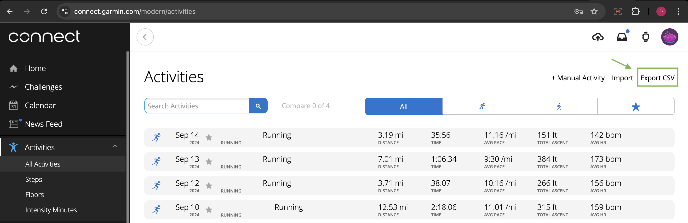
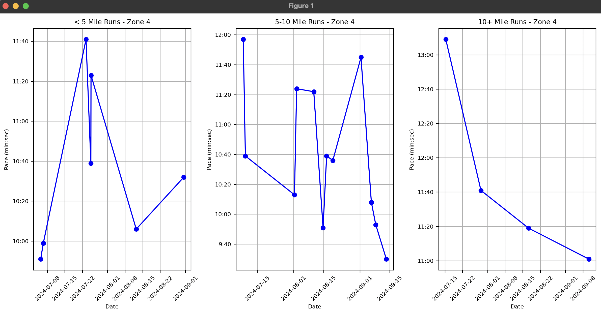

# Garmin pace visualization library

This package allows Garmin Connect users to pull `Activities` run data and visualize runs in 3 categories (< 5 mi, 5-10 mi, 10+ mi) by HR zone

## Prerequisites

- `python3`
- `pip`
- A Garmin Connect account
- An `Activities.csv` downloaded from your Garmin Connect account



## Getting started

Sync this repo to your local devenv, then create a Python virtual environment and install from `requirements.txt`. If you're not already familiar with Python venv setup, bash/zsh users can add this helper fn to their shell profile and run it in the context of this repo

```bash
new-python() {
  python3 -m venv .venv
  source .venv/bin/activate
  echo "python path is now $(which python)"
  python3 -m pip install --upgrade pip
  python3 -m pip install -r requirements.txt
}
```

Once deps have been installed, run the following command, which will (sequentially) launch pace visualizations for each mileage/HR bucket

```bash
python3 data.py && python3 data-visualization.py
```

> Note: `data.py` script assumes that an `Activities.csv` file was generated by visiting Garmin Connect, scrolling through all activities, and exporting to CSV. Without this file present in `~/Downloads`, you'll see loading errors. You can modify file load logic by substituting paths/filename conventions in `data.py`, for example

```python
# Get Garmin Connect activities data
print("Copying activities data to local dir...")
os.system("mv ~/Downloads/Activities.csv ./activities.csv") # Modify this as necessary
print("Successfully moved and renamed ~/Downloads/Activities.csv -> ./activities.csv")
```

## What you should see

`data.py` will log operations and stats to your terminal

```bash
Copying activities data to local dir...
mv: /Users/danielshapiro/Downloads/Activities.csv: No such file or directory
Successfully moved and renamed ~/Downloads/Activities.csv -> ./activities.csv
Processing Garmin activities data...
[SUCCESS] extracted all run data and wrote to csv
[SUCCESS] extracted long run data and wrote to csv
[SUCCESS] extracted zone 0 run data and wrote to csv
[SUCCESS] extracted zone 1 run data and wrote to csv
[SUCCESS] extracted zone 2 run data and wrote to csv
[SUCCESS] extracted zone 3 run data and wrote to csv
[SUCCESS] extracted zone 4 run data and wrote to csv
[SUCCESS] extracted zone 5 run data and wrote to csv
[SUCCESS] extracted weekly avg pace data and wrote to csv

/* --- STATS --- */

Total mileage:
255.57

Avg heart rate:
157.37209302325581

Weekly avg pace:
[('2024-07-12', '11:00'),
 ('2024-07-19', '12:59'),
 ('2024-07-29', '11:41'),
 ('2024-08-10', '11:21'),
 ('2024-08-17', '10:42'),
 ('2024-08-31', '10:56'),
 ('2024-09-07', '10:57')]

/* ------------- */
```

`pace-visualization.py` will create matplotlib graphs for each mileage segment, for example



> Note: each graph loads sequentially - only one set of graphs per HR zone is visualized at a time. To see the next set of HR zone-based graphs, close the current visualization. We'll likely improve this experience sometime soon...

## Troubleshooting

If you see the following error, the path to your Garmin Connect `Activities.csv` data is likely incorrect

```
Traceback (most recent call last):
  File "./garmin/data.py", line 137, in <module>
    with open("./activities.csv") as activities:
         ^^^^^^^^^^^^^^^^^^^^^^^^
FileNotFoundError: [Errno 2] No such file or directory: './activities.csv'
```
